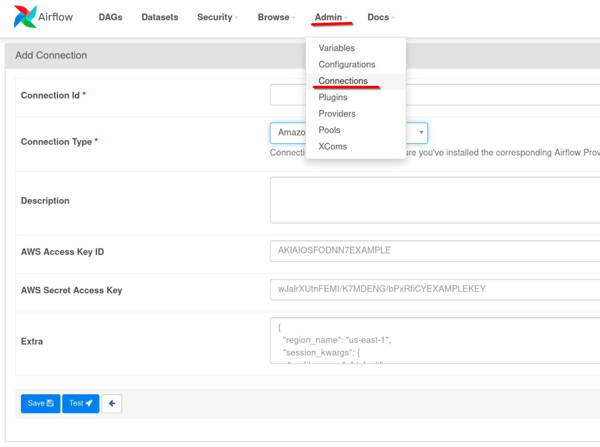
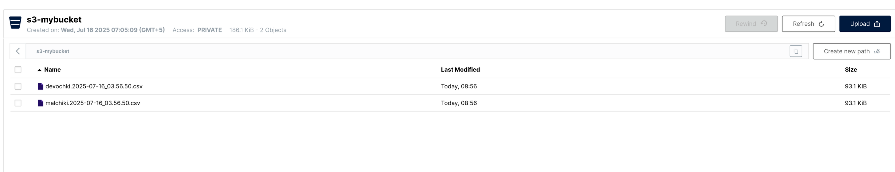
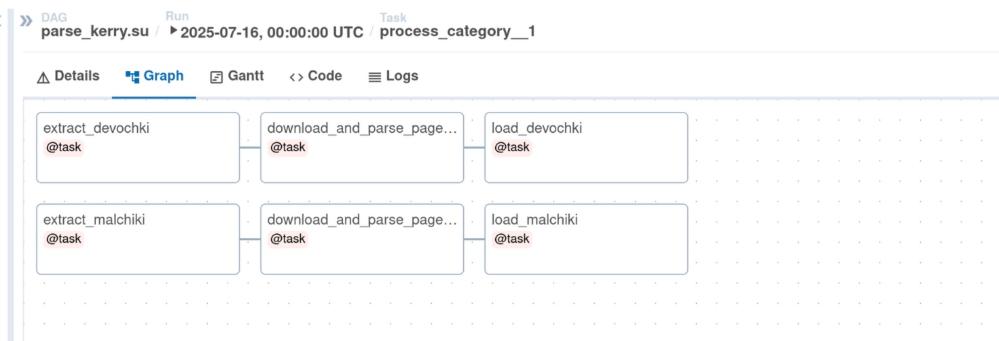

### Example Apache Airflow ETL Pipeline.

#### Описание.
Демонстрационная версия ETL парсера для Apache Airflow.

Парсит по одной (первой) страницы в 2х категориях на сайте [kerry.su](https://kerry.su).

Полученные данные сохраняет в `.csv` и загружает в `S3` хранилище.

####  Disclaimer.
Отвечу сразу на не заданный вопрос - `А почему парсится только один сайт и только первая страница?`

Этот код выдран из написанного на заказ парсера, и демонстрировать всю логику и все сайты было бы не этично по отношению к заказчику.

#### Запуск и тестирование.
* 1. Скопирьвать `airflow/.evn.example` в `airflow/.env`
* 2. Выставить `AIRFLOW_UID` и `AIRFLOW_GID` соответствующие вашему `UID` и `GID` в системе (см. вывод комманды `id`).
* 3. `make infra` - Поднимает `Apache Airflow` и `S3` хранилище `Minio`.
* 4. `make dep` или `cp parser_dag.py ./airflow/dags/` (просто первая короче) - копирует наш DAG в airflow, в принципе можно было и симлинком обойтись, но мне лень.
* 5. Идём в [консоль Minio](http://127.0.0.1:9001/) Логинимся под `MINIO_ROOT_USER` / `MINIO_ROOT_PASSWORD` созадаём backet для файлов и Acces Key в `Access Keys`.
* 6. В [Apache Airflow](http://127.0.0.1:8080/) и создаём соеденение с S3 хранилищем.

в `extra` добавляем `{"region_name": "us-east-1", "bucket_name": "s3-mybucket", "endpoint_url": "http://airflow-s3:9000"}`

* 7. Идём в `DAGs` находим `parse_kerry.su`, запускаем. После того как DAG отработает, идём в созданный bucket в minio и смотрим файлы.

* 8. `make stop` - Остановка контейнеров.

